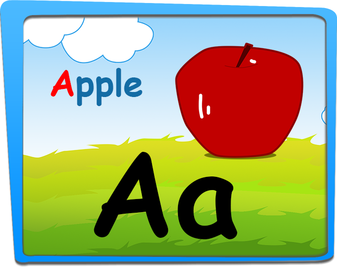

[![Contributors][contributors-shield]][contributors-url]
[![Stargazers][stars-shield]][stars-url]
[![Issues][issues-shield]][issues-url]
[![LinkedIn][linkedin-shield]][linkedin-url]


<!-- PROJECT LOGO -->
<br />
<p align="center">
  <a href="https://github.com/manhdvuetk63/JigSaw-Puzzle">
    
  </a>

  <h3 align="center">JIGSAW PUZZLE</h3>

  <p align="center">
Trò chơi giáo dục miễn phí này là sự giao thoa của bảng chữ cái, flashcards và trò chơi ghép hình. Những ý tưởng này được thiết kế để làm việc với trẻ em mẫu giáo và mẫu giáo. Nó làm cho việc học tiếng Anh rất thú vị. Tất cả những ý tưởng này giúp đảm bảo việc học tiếng Anh trở thành một trải nghiệm học tập tuyệt vời cho tất cả trẻ nhỏ.
    <br />
    <a href="https://github.com/manhdvuetk63/JigSaw-Puzzle"><strong>Explore the docs »</strong></a>
    <br />
    <br />
    <a href="https://manhdvuetk63.github.io/JigSaw-Puzzle/">View Demo</a>
    ·
    <a href="https://github.com/manhdvuetk63/JigSaw-Puzzle/issues">Report Bug</a>
    ·
    <a href="https://github.com/manhdvuetk63/JigSaw-Puzzle/issues">Request Feature</a>
  </p>
</p>


## Giới thiệu chung


### Công nghệ sử dụng

* []() Phaser 3 viết bằng kỹ thuật nâng cao của Javascript ES6 (ECMAScript 6 ).

Trang thông tin : <a href="https://www.phaser.io/">Phaser.io </a>
* []() JSON: Định dạng dữ liệu đầu vào của dự án : âm thanh, hình ảnh.

<!-- GETTING STARTED -->
## Cách cài đặt.


1. Clone the repo
```sh
git clone https://github.com/manhdvuetk63/JigSaw-Puzzle.git
```
2. Chạy project
Chọn một trình biên dịch hỗ trợ phát triển ứng dụng web, tiêu biểu như: Sublime Text, Atom, Visual Studio Code, Brackets, WebStorm,... Sau đó chạy file index.html
### Thay đổi dữ liệu

1- Thay đổi bộ asset
2- Thay đổi cấu trúc file JSON

## Liên hệ

Đặng Văn Mạnh- [@facebook](https://www.facebook.com/dvmanhuet) - email: natrihoatri1@gmail.com / manhdvvnu@gmail.com

Project Link: [https://github.com/manhdvuetk63/JigSaw-Puzzle](https://github.com/manhdvuetk63/JigSaw-Puzzle)


[contributors-shield]: https://img.shields.io/github/contributors/othneildrew/Best-README-Template.svg?style=flat-square
[contributors-url]:https://github.com/manhdvuetk63/JigSaw-Puzzle/graphs/contributors
[stars-shield]: https://img.shields.io/github/stars/othneildrew/Best-README-Template.svg?style=flat-square
[stars-url]: https://github.com/manhdvuetk63/JigSaw-Puzzle/stargazers
[issues-shield]: https://img.shields.io/github/issues/othneildrew/Best-README-Template.svg?style=flat-square
[issues-url]: https://github.com/manhdvuetk63/JigSaw-Puzzle/issues
[linkedin-shield]: https://img.shields.io/badge/-LinkedIn-black.svg?style=flat-square&logo=linkedin&colorB=555
[linkedin-url]: https://manhdvuetk63.github.io/JigSaw-Puzzle/
[product-screenshot]: img-in-game/puzzleGameScene.png
